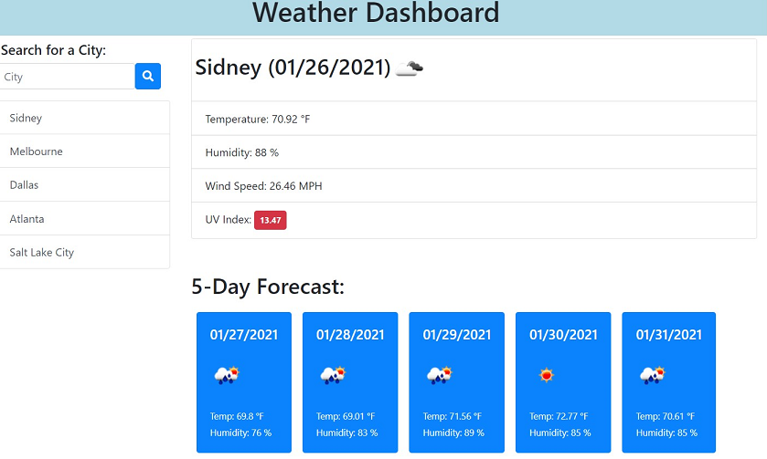

# Weather Dashboard Project
This project implements the jQuery Ajax method to access a server-side API. In this case it is an API that contains weather data in multiple cities and is kept up to date, both for the current situation as well as the 5-day forecast. Using JSON objects makes it easier to manipulate data to be displayed on screen, and for a better user experience the localStorage function is used.
https://jamaya273.github.io/WeatherDash/
 
--- 

## How to use the application
The page works by typing the city name in the input field. The function calls two APIs, one for the current weather and one for the weather forecast. The values are displayed on the screen.
The UV index indicator has a color code: green for favorable (<3), yellow for moderate (4 to 7), red (>7) for severe.
It also has the function of initially presenting last city searched above, as well as a list of the last 10 searches, which in turn can be re-selected with one click.

---

## Summary
The project is a set of technologies that we have learned so far, such as JSON, AJAX, APIs and allowed us to reaffirm the concepts of HTML, Bootstrap, CSS, jQuery. In this particular case I found it important to think about the design of the user interface

